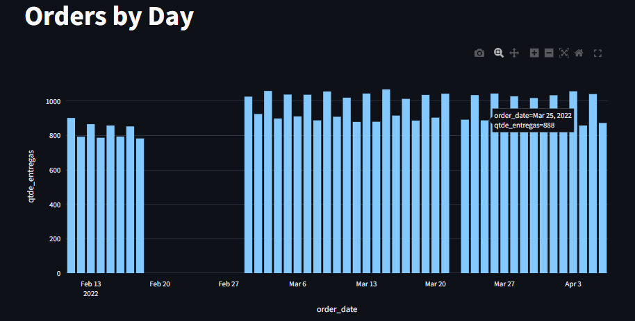

# Análise-curry-company
# Problema de negócio
# Contexto
# Premissas da análise
# Estratégia da solução
## Passo 1: Resumir o contexto em uma pergunta aberta
## Passo 2: Transformar pergunta aberta em fechada
## Passo 3: Definição da coluna fato
## Passo 4: Identificação das dimensões
## Passo 5: Hipóteses analíticas
## Passo 6: Critérios de priorização
## Passo 7: Priorização das hipoteses analiticas
# Insights da análise
# Resultados
## Visualize a análise completa

